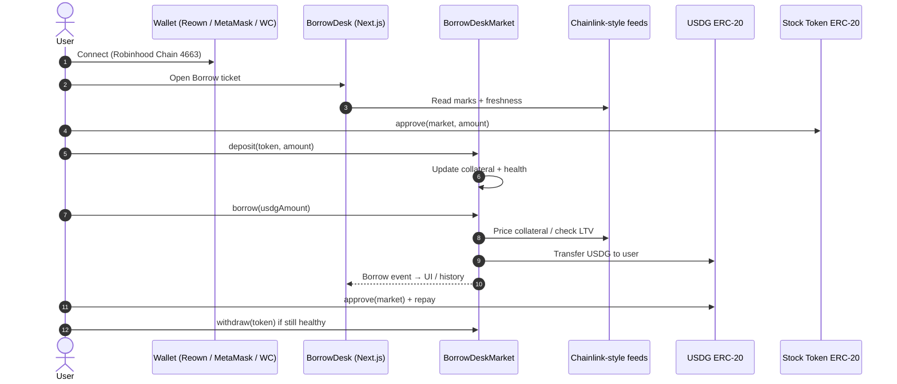
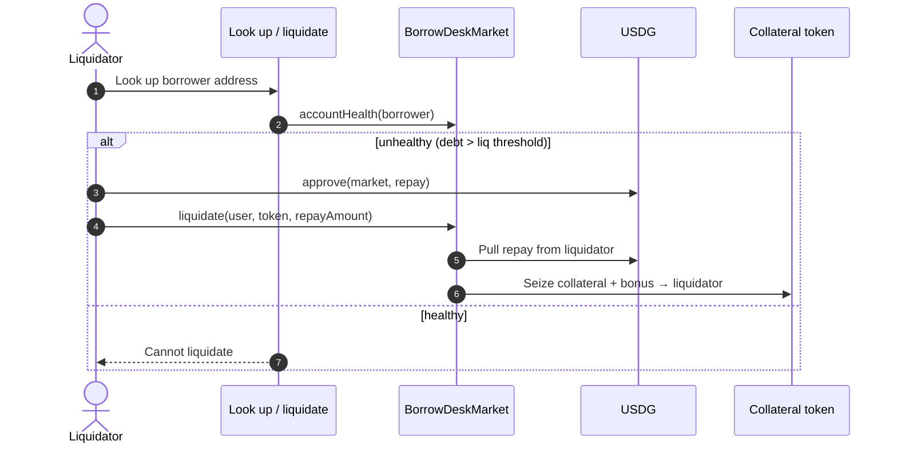
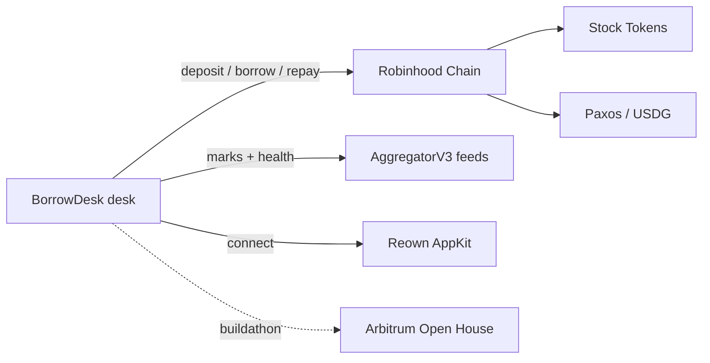
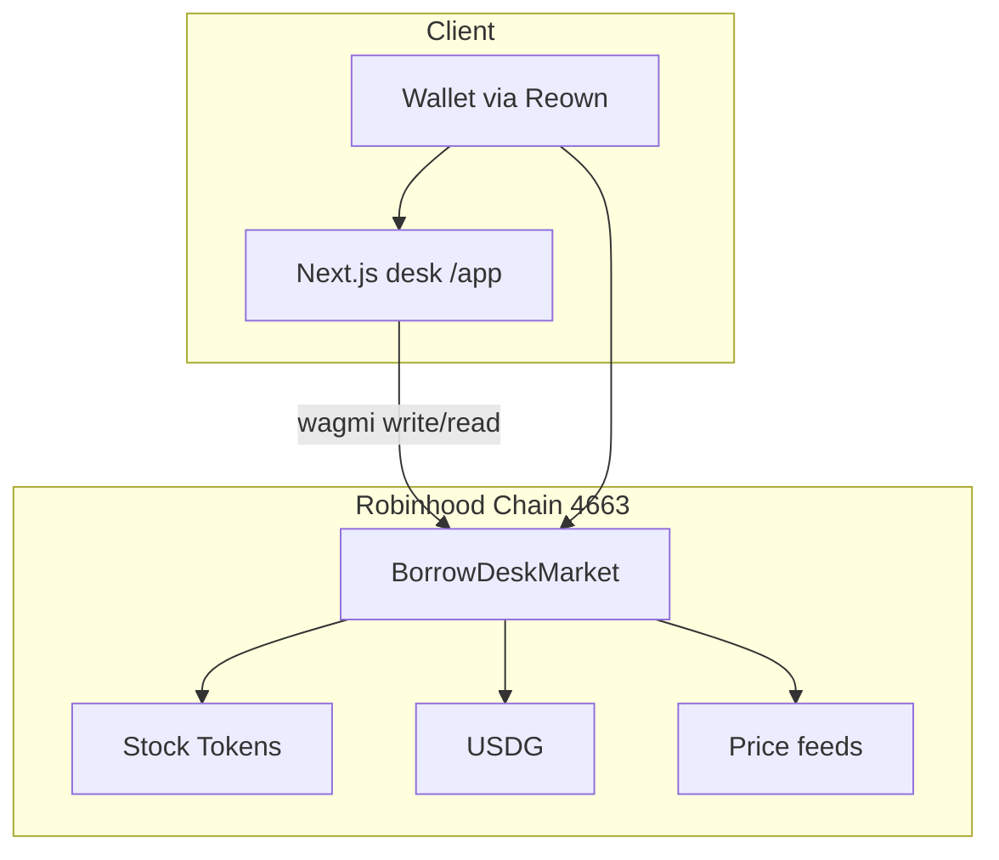

# BorrowDesk

**Keep the stocks. Borrow the dollar.**

Collateralized USDG credit lines against Robinhood Chain Stock Tokens - deposit NVDA / AAPL / TSLA / SPY, borrow Global Dollar, see liquidation math before you sign.

## Links

| | |
|---|---|
| **Live app** | [https://borrowdesk.fun](https://borrowdesk.fun) · [Open desk](https://borrowdesk.fun/app) · [Verify claims](https://borrowdesk.fun/verify) |
| **Pitch deck** | [Chronicle share](https://app.chroniclehq.com/share/0f55cc23-897b-4a17-9ae9-c430e7e7eadb/50e19e22-0cd9-437e-afc0-9cab97129f3f) |
| **Demo + pitch video** | [youtu.be/KuaS7UGdRvY](https://youtu.be/KuaS7UGdRvY) |
| **Litepaper** | [Markdown](./docs/BorrowDesk-Litepaper.md) · [PDF](./docs/BorrowDesk-Litepaper.pdf) |
| **Vercel** | [https://borrowdesk.vercel.app](https://borrowdesk.vercel.app) |
| **GitHub** | [github.com/AmaanSayyad/BorrowDesk](https://github.com/AmaanSayyad/BorrowDesk) |
| **Hackathon** | [Arbitrum Open House Singapore Online Buildathon](https://arbitrum-singapore.hackquest.io/buildathons/Arbitrum-Open-House-Singapore-Online-Buildathon) |
| **Market V2** | [`0x1745…0200`](https://robinhoodchain.blockscout.com/address/0x17452DAB5976B770107c126fBC92aD746a3C0200) · [Sourcify exact match](https://repo.sourcify.dev/4663/0x17452DAB5976B770107c126fBC92aD746a3C0200) |
| **Lens** | [`0x0256…55cc`](https://robinhoodchain.blockscout.com/address/0x025694b88ddd0a6ffac740df4170b8ea590355cc) · [Sourcify exact match](https://repo.sourcify.dev/4663/0x025694b88ddd0a6ffac740df4170b8ea590355cc) |
| **Legacy V1** | [`0x2e4E…9E8d`](https://robinhoodchain.blockscout.com/address/0x2e4E7E8145E4cCA7E0fEf4737A2489E4E27D9E8d) · drained / unused · [Sourcify](https://repo.sourcify.dev/4663/0x2e4E7E8145E4cCA7E0fEf4737A2489E4E27D9E8d) |
| **USDG** | [`0x5fc5…d168`](https://robinhoodchain.blockscout.com/address/0x5fc5360D0400a0Fd4f2af552ADD042D716F1d168) |
| **Explorer** | [robinhoodchain.blockscout.com](https://robinhoodchain.blockscout.com) |
| **RPC** | `https://robinhood.drpc.org` · chain id `4663` |
| **Manifest** | [`deployments/robinhood.json`](./deployments/robinhood.json) |
| **Local** | `npm run dev` → [http://localhost:3000](http://localhost:3000) · [app](http://localhost:3000/app) |

| | |
|---|---|
| **Product one-liner** | Stock Tokens → USDG credit on Robinhood Chain (4663) |
| **Status** | Mainnet live · V2 + Lens verified · V1 drained · HF /10 UI |

---

## Table of contents

1. [What this is and who it's for](#what-this-is-and-who-its-for)
2. [Story & inspiration](#story--inspiration)
3. [Problem](#problem)
4. [Solution](#solution)
5. [How it works](#how-it-works)
6. [Target users](#target-users)
7. [Features](#features)
8. [Addresses & live proof](#addresses--live-proof)
9. [Sponsor & partner integrations](#sponsor--partner-integrations)
10. [Tech stack](#tech-stack)
11. [Architecture](#architecture)
12. [Competitors](#competitors)
13. [Go to market](#go-to-market)
14. [Business model](#business-model)
15. [Roadmap](#roadmap)
16. [Team](#team)
17. [Run locally](#run-locally)
18. [Verify / tests](#verify--tests)
19. [Repo layout](#repo-layout)
20. [License](#license)

---

## What this is and who it's for

**What:** A collateralized lending market on **Robinhood Chain** where holders of official Stock Tokens (NVDA, AAPL, TSLA, SPY, …) deposit equity exposure as collateral and borrow **USDG (Global Dollar)** without selling. Health, LTV, liquidation threshold, interest accrual, and partial liquidation are enforced onchain. The desk UI shows liq price, buffer, oracle provenance, and repay receipts before you sign.

**Who it's for**

| Audience | Why they care |
|---|---|
| Stock Token holders | Unlock dollar liquidity without selling equity upside |
| Crypto-native borrowers | USDG credit against real equity marks on RH Chain |
| Liquidators | Partial liquidations with bonus via Look up · accrue interest onchain |
| Judges / operators | Live mainnet market, Reown wallet, desk tabs, ⌘K search |

**Not this product:** We are not a spot DEX, not a perp venue, and not an issuer of Stock Tokens or USDG. We compose the assets Robinhood / Paxos already put onchain.

---

## Story & inspiration

In 2025-2026, **Robinhood Chain** launched as an EVM home for tokenized equities: Stock Tokens with Chainlink-style feeds, Global Dollar (USDG) as the dollar rail, and an open permissionless L2. At the same time, most “stock leverage” still lived on CEXes or non-RH venues - holders of NVDA / AAPL tokens could not post those assets as collateral for USDG credit on the same chain.

BorrowDesk is built RH-Chain-native from day one: a `BorrowDeskMarket` V2 with multi-collateral accounts, supply shares, utilization APR, oracle-priced LTV bands, and partial liquidation - plus a full credit desk (Fund, Protocol, health /10, ticket, markets, risk, look up, asset pages, TradingView).

The inspiration is simple: **bring dollar credit to where the stocks already are**, let those stocks be collateral, and show liquidation foresight so nobody is surprised by a liquidatable LTV.

> Positioning: _Keep the stocks. Borrow the dollar._

---

## Problem

1. **Equity locked as dead collateral.** Stock Token holders who need USDG must sell or leave RH Chain.
2. **Credit venues ignore the asset.** Generic money markets are crypto-collateral first; equity marks and 24/5 sessions need different risk.
3. **Opaque liquidation UX.** Most lending UIs hide liq price, buffer $, and interest until after you sign.
4. **Desk UX is missing.** Deposit / borrow / repay / liquidate / oracle freshness should feel like one credit desk, not five scattered pages.
5. **Wallet friction.** Injected-only connect blocks WalletConnect / mobile judges.

---

## Solution

| Pillar | What we ship |
|---|---|
| Multi-collateral credit | Deposit NVDA / AAPL / TSLA / SPY into one account; borrow USDG |
| Oracle-priced risk | Chainlink-style AggregatorV3 feeds; per-asset LTV / liq / bonus bands |
| Foresight ticket | LTV slider, est. liq price, drop-to-liquidatable, interest/day, repay receipt |
| Partial liquidation | Repay underwater debt, seize collateral at bonus - not full-debt-only |
| Live desk | Overview · Borrow · Fund · Positions · Markets · Protocol · Risk · Look up · Start |
| Reown wallet | AppKit (WalletConnect + injected) on chain 4663 |

---

## How it works

### Trust model

User funds only move when the connected wallet signs ERC-20 `approve` + market calls (`deposit`, `borrow`, `repay`, `withdraw`, `supply`, `redeem`, `liquidate`). The market owner can list markets, set oracle delay, and seed USDG liquidity - **not** seize healthy user collateral. Oracles are external AggregatorV3 feeds; stale reads revert when beyond `maxOracleDelay` (default **4 days** for 24/5 equity weekends).

### End-to-end credit (happy path)



### Liquidation path



---

## Target users

- **Stock Token holders** - borrow USDG against NVDA / AAPL / TSLA / SPY without selling.
- **USDG seekers** - dollar liquidity on RH Chain with equity collateral.
- **Liquidators** - partial repay + seize with liquidation bonus.
- **Desk operators / judges** - live market, Reown connect, onboarding path, explorer links.

---

## Features

### Markets (desk)

| Symbol | Role | LTV band (config) |
|---|---|---|
| SPY | Broad index · highest LTV | ~65% |
| NVDA / AAPL | Mega-cap · standard | ~60% |
| TSLA | Higher vol · tighter | ~50% |
| AMZN / MSFT / META / GOOGL + 21 more | Listed on mainnet (29 total) | Equity-tuned bands |

Settlement asset: **USDG** (`0x5fc5…d168`, 6 decimals).  
Marks: onchain AggregatorV3 + RHJ `/prices` API fallback in UI.  
Charts: TradingView embeds on asset pages.

### Credit actions

- Deposit / withdraw Stock Tokens
- Borrow / repay USDG
- Supply / redeem USDG (V2 supply shares)
- Interest accrues inside market actions (~5% base · utilization APR on V2)
- Partial liquidate unhealthy accounts
- Multi-collateral account health (HF on a **0–10** UI scale, LTV, borrow power, liq threshold)

### Desk UX

- Desk tabs: Overview · Borrow · Fund · Positions · Markets · Protocol · Risk · Look up · Start
- Fund desk: get stock (swap) · supply USDG · batch deposit+borrow
- Borrow sheet: LTV slider, liq price, buffer, interest/day
- Repay receipt: est. principal / interest / days open
- ⌘K command palette (tickers, desks, actions)
- Oracle provenance strip (freshness, 4d weekend policy)
- Per-asset risk reasons + stress “drop to HF ≈ 1”
- Reown AppKit wallet modal
- Judge path onboarding (ETH gas + Stock Tokens + deposit → borrow)

---

## Addresses & live proof

Public addresses only. **Never commit** private keys or `.env`.

### Mainnet (Robinhood Chain `4663`)

| Role | Address | Notes |
|---|---|---|
| **BorrowDeskMarket V2** | [`0x17452DAB5976B770107c126fBC92aD746a3C0200`](https://robinhoodchain.blockscout.com/address/0x17452DAB5976B770107c126fBC92aD746a3C0200) | Live credit market · util APR · [Sourcify exact match](https://repo.sourcify.dev/4663/0x17452DAB5976B770107c126fBC92aD746a3C0200) |
| **BorrowDeskLens** | [`0x025694b88ddd0a6ffac740df4170b8ea590355cc`](https://robinhoodchain.blockscout.com/address/0x025694b88ddd0a6ffac740df4170b8ea590355cc) | Desk reads · [Sourcify exact match](https://repo.sourcify.dev/4663/0x025694b88ddd0a6ffac740df4170b8ea590355cc) |
| **Legacy V1** | [`0x2e4E7E8145E4cCA7E0fEf4737A2489E4E27D9E8d`](https://robinhoodchain.blockscout.com/address/0x2e4E7E8145E4cCA7E0fEf4737A2489E4E27D9E8d) | Drained · unused · funds migrated to V2 · [Sourcify](https://repo.sourcify.dev/4663/0x2e4E7E8145E4cCA7E0fEf4737A2489E4E27D9E8d) |
| **Owner** | `0x1881Dfd2b29536F054AA0b0A4966856290388Cc2` | Market owner |
| **USDG** | `0x5fc5360D0400a0Fd4f2af552ADD042D716F1d168` | Global Dollar · 6 decimals |
| **V2 deploy tx** | [`0xe937fb…dfa0`](https://robinhoodchain.blockscout.com/tx/0xe937fb4b81a7ac7f88e1f8bc586661e06ff296764305ff7fa88a40c91a7edfa0) | Market create |
| **RPC (preferred)** | `https://robinhood.drpc.org` | Official Cloudflare RPC often 403s forge |
| **Explorer** | [robinhoodchain.blockscout.com](https://robinhoodchain.blockscout.com) | |

### Listed collateral + feeds (29 markets)

All mainnet markets use AggregatorV3 feeds. Full machine-readable list: [`deployments/robinhood.json`](./deployments/robinhood.json).

| Symbol | Token | Feed |
|---|---|---|
| NVDA | `0xd0601CE157Db5bdC3162BbaC2a2C8aF5320D9EEC` | `0x379EC4f7C378F34a1B47E4F3cbeBCbAC3E8E9F15` |
| AAPL | `0xaF3D76f1834A1d425780943C99Ea8A608f8a93f9` | `0x6B22A786bAa607d76728168703a39Ea9C99f2cD0` |
| TSLA | `0x322F0929c4625eD5bAd873c95208D54E1c003b2d` | `0x4A1166a659A55625345e9515b32adECea5547C38` |
| SPY | `0x117cc2133c37B721F49dE2A7a74833232B3B4C0C` | `0x319724394D3A0e3669269846abE664Cd621f9f6A` |
| AMZN | `0x12f190a9F9d7D37a250758b26824B97CE941bF54` | `0xD5a1508ceD74c084eBf3cBe853e2C968fB2a651C` |
| MSFT | `0xe93237C50D904957Cf27E7B1133b510C669c2e74` | `0x45C3C877C15E6BA2EBB19eA114Ea508d14C1Af2E` |
| META | `0xc0D6457C16Cc70d6790Dd43521C899C87ce02f35` | `0x7C38C00C30BEe9378381E7B6135d7283356D71b1` |
| GOOGL | `0x2e0847E8910a9732eB3fb1bb4b70a580ADAD4FE3` | `0xF6f373a037c30F0e5010d854385cA89185AE638b` |
| AMD | `0x86923f96303D656E4aa86D9d42D1e57ad2023fdC` | `0x943A29E7ae51A4798823ca9eEd2ed533B2A22C72` |
| ASML | `0x47F93d52cBeC7C6D2CfC080e154002370a60dAEA` | `0xB4106147E8cce40b7d46124090d373A71b70f87D` |
| BABA | `0xad25Ac6C84D497db898fa1E8387bf6Af3532a1c4` | `0x62Cc8F9b5f56a33c9C8A60c8B92779f523c4E984` |
| COIN | `0x6330D8C3178a418788dF01a47479c0ce7CCF450b` | `0xA3a468A452940B7D6b69991207B508c609a98Ef2` |
| CRCL | `0xdF0992E440dD0be65BD8439b609d6D4366bf1CB5` | `0x6652eDf64bA3731C4F2D3ce821A0Fb1f1f6b482a` |
| DELL | `0x941AE714EC6D8130c7B75d67160Ca08f1e7d11Dd` | `0x1C6c8cADBe02E19129c39dDB92281cE4c0bf206b` |
| GME | `0x1b0E319c6A659F002271B69dB8A7df2F911c153E` | `0x27C71df6A64fB476468EdF256CF72c038baB5B67` |
| INTC | `0xc72b96e0E48ecd4DC75E1e45396e26300BC39681` | `0x3f390C5C24628Ac7C489515402235FeAD71D1913` |
| IONQ | `0x558378E000D634A36593E338eBacdd6207640EfE` | `0x22EfeC4919baf55F360E0EDee4AbEB26DE4971eb` |
| MSTR | `0xec262a75e413fAfD0dF80480274532C79D42da09` | `0x396118bdFB181e6240E74D243F266B061c0edc3D` |
| MU | `0xfF080c8ce2E5feadaCa0Da81314Ae59D232d4afD` | `0x425EEFdCf05ed6526C3cE61Af99429A228a6d596` |
| PLTR | `0x894E1EC2D74FFE5AEF8Dc8A9e84686acCB964F2A` | `0x820ABedFF239034956B7A9d2F0a331f9F075eB4c` |
| RKLB | `0x3b14C39E89D60D627b42a1A4CA45b5bb45Fc12e2` | `0x045477BF65Aef6f4F2386ad0164579e48381CC74` |
| SNDK | `0xB90A19fF0Af67f7779afF50A882A9CfF42446400` | `0xfb133Fa4B7b385802B693a293606682Df47109A3` |
| SPCX | `0x4a0E65A3EcceC6dBe60AE065F2e7bb85Fae35eEa` | `0xB265810950ba6c5C0Ff821c9963014a56fD8Bffb` |
| TSM | `0x58FfE4a942d3885bAa22D7520691F611EF09e7AA` | `0x874cF94aa8eC88Fd9560094dD065f2fB3E41Fc2F` |
| USAR | `0xd917B029C761D264c6A312BBbcDA868658eF86a6` | `0xA994d3684e8400A6c8078226925779FdeE682DD9` |
| QQQ | `0xD5f3879160bc7c32ebb4dC785F8a4F505888de68` | `0x80901d846d5D7B030F26B480776EE3b29374C2ae` |
| SLV | `0x411eFb0E7f985935DAec3D4C3ebaEa0d0AD7D89f` | `0x209b73908e92Ae021826eD79609845451Ecba2ce` |
| USO | `0xa30FA36Db767ad9eD3f7a60fC79526fB4d56D344` | `0x75a9c76Ef439e2C7c2E5a34Ab105EcFe3766431c` |
| SGOV | `0x92FD66527192E3e61d4DDd13322Aa222DE86F9B5` | `0xa0DF4ee0fFf975306345875E3548Fcc519577A11` |

### Proven onchain position (deployer · V2)

| Metric | Value |
|---|---|
| Collateral (oracle USD) | ~$1.32 |
| Debt | **~0.0001 USDG** (dust) |
| Pool liquidity (idle) | **~4.80 USDG** |
| Healthy | `true` |
| Deposited | Multi-collateral (NVDA / AAPL + migrated V1 books) |
| Health factor (UI) | **10/10** (capped display · raw liq/debt) |

See `MAINNET.md` for the latest snapshot.

**Interest:** ~**5% base APR** plus utilization-based borrow APR on V2 (`BorrowDeskMarket.sol`).

---

## Sponsor & partner integrations

BorrowDesk wires the Open House stack for **chain, wallet, dollar rail, and desk UX** - not for custody of user funds beyond the market contract.



| Partner | Role in BorrowDesk |
|---|---|
| **Arbitrum Open House Singapore** | Buildathon context / stack |
| **Robinhood Chain** | Settlement L2 (4663), Stock Tokens, explorer |
| **Paxos / USDG** | Borrow asset (Global Dollar) |
| **Reown** | WalletConnect + multi-wallet AppKit (`NEXT_PUBLIC_REOWN_PROJECT_ID`) |
| **Chainlink-style feeds** | Onchain equity marks via AggregatorV3 |
| **TradingView** | Asset charts / tape embeds |
| ZeroDev · Quicknode · Dune · Trail of Bits · GMX · Pendle | Open House ecosystem strip (landing) |

**Reown setup:** create a project at [dashboard.reown.com](https://dashboard.reown.com), set `NEXT_PUBLIC_REOWN_PROJECT_ID`, and allowlist `http://localhost:3000` + your deploy origin under Configuration.

---

## Tech stack

| Layer | Choice |
|---|---|
| Frontend | Next.js 16, React 19, Tailwind 4, Framer Motion |
| Wallets | Reown AppKit + `@reown/appkit-adapter-wagmi`, wagmi 3, viem 2 |
| Data | TanStack Query |
| Contracts | Solidity 0.8.24, Foundry |
| Networks | Robinhood Chain mainnet `4663` |
| Prices | Onchain AggregatorV3 + `/api/prices/[symbol]` (RHJ) |
| Charts | TradingView embeds |

---

## Architecture

### System shape



### Contract surface

```
User wallet
   │  approve + deposit / withdraw / borrow / repay / supply / redeem / liquidate / accrue
   ▼
BorrowDeskMarket V2
   ├── markets[token] → feed, ltvBps, liqBps, bonusBps, listed
   ├── accounts[user] → collateral map, debt principal + index
   ├── supplyShares / totalSupplyShares / assetsOf
   ├── borrowIndex / lastAccrual / totalDebt / totalUsdgLiquidity
   ├── utilizationBps / previewBorrowAprBps
   └── accountHealth(user) → collateralUsd, debtUsd, power, liqUsd, healthy
BorrowDeskLens → batched desk reads
```

Design notes live in `contracts/src/BorrowDeskMarket.sol` and `contracts/README.md`.

---

## Competitors

Market map for **borrow against tokenized equities / Stock Tokens for USD (G)**. Sources: Morpho + Robinhood Earn docs, Acre / Zona product pages, Pledge / TALIS launches, Ondo + xStocks + Coinbase Morpho markets (2026).

### Same chain (Robinhood Chain · 4663) - closest

| Venue | What they do | How we differ |
|---|---|---|
| **[Morpho](https://morpho.org)** on RH Chain | Default credit rail. Stock Tokens as collateral → borrow stables; also underpins [Robinhood Earn](https://robinhood.com/us/en/support/articles/crypto-earn/) (USDG supply via Steakhouse vaults). Deepest liquidity + institutional curators. | Generic isolated Morpho markets + vault UX. BorrowDesk is a **purpose-built equity credit desk**: multi-collateral account, equity LTV bands, util APR, Fund / Protocol / Look up, liq foresight before sign. |
| **[Acre](https://useacre.xyz)** | Multi-collateral USDG pool vs RH Stock Tokens / ETFs. Session-aware borrow rates; supply shares; exposure caps (~50k supply). | Closest product twin. We ship a fuller **desk** (⌘K, health /10, ticket receipts, get-stock path, 29 listed feeds) and public V2 + Lens verification. |
| **[Zona](https://www.zona.finance)** | Supply USDG or borrow vs AAPL / NVDA / META / SPCX / SPY / QQQ / SGOV. 24/5 borrow window; one equity collateral at a time. | Single-collateral positions + weekend close. BorrowDesk keeps **one multi-collateral book**, 24/7 desk UX with 4d oracle delay for equity weekends, Fund desk for inventory. |
| **[Pledge Finance](https://arbitrum-singapore.hackquest.io/projects/Pledge-Finance-TRgoRA)** | Isolated vaults (one user × one ticker × USDG). NVDA / SPY first; stability fee; inventory-gated borrows. | Isolated per-ticker vaults vs our **shared multi-collateral account** + supply shares + batch deposit+borrow. |
| **[TALIS](https://cryptobriefing.com/talis-onchain-structured-markets-tokenized-stocks/)** | Split Stock Tokens into Income + Upside (structured, not a money market). | Adjacent - structured products, not USDG credit lines. Complementary, not a substitute for BorrowDesk. |

### Other chains / issuers (same job, different rails)

| Venue | What they do | Why not a direct substitute |
|---|---|---|
| **Ondo Stocks + Morpho / Euler** | SPYon / QQQon (/ TSLAon) as collateral → borrow USDC on Ethereum; Gauntlet / Sentora risk. | Different issuance + settlement chain. Not Robinhood Stock Tokens or USDG on 4663. |
| **xStocks (Backed) + Morpho** | e.g. SPYx → borrow AUSD (Flowdesk vault). | Ethereum / issuer stack; Agora AUSD, not Paxos USDG on RH Chain. |
| **Coinbase tokenized stocks + Morpho (Base)** | AAPLc / NVDAc / … → borrow USDC; Aave / Euler also listed. | Base + Coinbase wrappers; geo-fenced; not RH Stock Tokens. |
| **Broker / CEX margin** | Sell equity or borrow cash in a custodial account. | Leaves the chain, kills self-custody composability, often forces a sale. |

### Positioning

| Axis | BorrowDesk |
|---|---|
| Settlement | Robinhood Chain mainnet only |
| Borrow asset | Paxos **USDG** |
| Collateral | Official RH Stock Tokens · **29** feed-backed markets |
| Account model | Multi-collateral · shared health · partial liquidations |
| UX bet | Credit **desk** (foresight ticket, Fund, Protocol, Look up, Reown) not a raw Morpho market page |

**Honest gap vs Morpho:** Morpho wins on curated liquidity depth and Robinhood distribution. BorrowDesk wins on RH-native desk UX, multi-collateral account shape, and equity-tuned risk presentation for Stock Token holders who want dollars without selling.

---

## Go to market

1. **Mainnet desk** - 29 feed-backed Stock Token / ETF markets listed live, borrow proven, Reown connect.
2. **Judge path** - Get started tab: chain 4663 → ETH gas → Stock Tokens → deposit → borrow.
3. **Liquidity narrative** - grow USDG inventory beyond toy-scale (~$4.80 idle today); show pool clearly in UI.
4. **Distribution** - Open House demos, RH Chain explorer links, Stock Token holder loops.
5. **Trust** - verified contracts, public addresses in this README, live desk + explorer links.

---

## Business model

### Today (buildathon)

| Stream | Mechanism |
|---|---|
| **Borrow interest** | ~5% base APR (+ util APR on V2) on outstanding USDG debt |
| **Liquidation bonus** | Liquidators repay USDG and seize collateral at configured bonus bps |
| **Protocol inventory** | Owner-seeded + public USDG supply shares earn as utilization grows |

No protocol fee on borrows today. No product token today. Demo metric: **healthy Stock Token → USDG credit on mainnet**.

### Future

| Stream | Mechanism |
|---|---|
| **1% borrow fee** | Charge **1%** of each USDG borrow (origination) to the protocol treasury - paid in USDG at draw |
| **Product token launch** | Launch a BorrowDesk protocol token for governance, fee-share / staking alignment, and liquidity incentives (suppliers, liquidators, desk growth) - **not** the borrow asset (USDG stays Paxos) |
| **Interest + util APR** | Keep borrower interest; route a share of accrued interest to suppliers / treasury / token stakers as inventory scales |
| **Liquidation bonus** | Unchanged - market-paid incentive for keeping the book solvent |

Example: borrow **100 USDG** → **1 USDG** protocol fee → **99 USDG** net to the borrower (parameters subject to token governance once launched).

---

## Roadmap

| Phase | Focus | Status |
|---|---|---|
| 0 | Market contract, Foundry tests, deploy script | Done |
| 1 | Mainnet list NVDA/AAPL/TSLA/SPY + seed USDG + proven borrow | Done |
| 2 | Desk UI: health, ticket, markets, liquidate, asset pages, TV | Done |
| 3 | Reown AppKit, LTV slider, repay receipt, desk tabs, ⌘K, oracle strip | Done |
| 4 | V2 market: supply shares, util APR, Fund desk, Lens, Sourcify exact match | Done |
| 5 | V1 → V2 liquidity + collateral migration · HF /10 UI · borrowdesk.fun | Done |
| Next | Grow pool, ownership rotation, liquidation bots | In progress |
| Later | **1% borrow fee**, **product token launch**, audits, larger inventory, more Stock Token bands | Planned |

**Explicit non-goals (buildathon):** spot trading as a venue, issuing Stock Tokens, perps, cross-chain deploy.

---

## Team

| | |
|---|---|
| **Product** | BorrowDesk |
| **Event** | Arbitrum Open House Singapore Online Buildathon |
| **Chain** | Robinhood Chain mainnet |

### Builder

**Amaan Sayyad** - blockchain developer · entrepreneur  
Hackathon builder · shipped Web3 products · founder / speaker / grantee

| | |
|---|---|
| X | [@amaanbiz](https://x.com/amaanbiz) |
| GitHub | [AmaanSayyad](https://github.com/AmaanSayyad) |
| LinkedIn | [amaan-sayyad-](https://www.linkedin.com/in/amaan-sayyad-/) |
| Portfolio | [amaansayyad.com](https://amaansayyad.com) |
| Pitch deck | [Chronicle](https://app.chroniclehq.com/share/0f55cc23-897b-4a17-9ae9-c430e7e7eadb/50e19e22-0cd9-437e-afc0-9cab97129f3f) |
| Demo + pitch video | [YouTube](https://youtu.be/KuaS7UGdRvY) |

For security reports, contact privately - do not open issues that include exploit PoCs against live funds.

---

## Run locally

### Prerequisites

- Node **≥ 20**
- Optional: Foundry (`forge`) for contracts

### 1. Install

```bash
cd openline
npm install
```

### 2. Env

```bash
cp .env.example .env
# Edit .env - never commit it.
```

Minimum for the live desk:

```bash
NEXT_PUBLIC_CHAIN_ID=4663
NEXT_PUBLIC_RH_RPC_URL=https://robinhood.drpc.org
NEXT_PUBLIC_BORROWDESK_MARKET=0x17452DAB5976B770107c126fBC92aD746a3C0200
NEXT_PUBLIC_BORROWDESK_LENS=0x025694b88ddd0a6ffac740df4170b8ea590355cc
NEXT_PUBLIC_SITE_URL=https://borrowdesk.fun
NEXT_PUBLIC_REOWN_PROJECT_ID=          # from dashboard.reown.com
```

Optional deploy / seed (server-only - never commit):

```bash
PRIVATE_KEY=
RH_RPC_URL=https://robinhood.drpc.org
USDG_LIQUIDITY=500
```

### 3. Desk

```bash
npm run dev
# → http://localhost:3000
# App → http://localhost:3000/app
```

Connect via Reown on **Robinhood Chain (4663)** with Stock Tokens + ETH for gas.

### 4. Contracts (optional)

```bash
npm run test:contracts
# or
cd contracts && forge test -vv
```

Mainnet deploy helper:

```bash
npm run deploy:mainnet
```

---

## Verify / tests

```bash
npm run lint
npm run build
npm run test:contracts
```

Manual E2E checklist:

1. Connect wallet (Reown) on chain 4663  
2. Deposit listed Stock Token  
3. Borrow USDG (see liq foresight)  
4. Accrue / repay (see receipt)  
5. Withdraw if healthy  
6. Liquidate path only when `accountHealth` is unhealthy  

---

## Repo layout

| Path | What it is |
|---|---|
| `src/app/` | Next.js App Router (landing + `/app` desk + `/app/[symbol]`) |
| `src/components/` | Desk, landing, charts, UI |
| `src/hooks/` | Live market, oracles, prices, activity |
| `src/lib/` | Chains, wagmi/Reown, tokens, ABI, deployments |
| `contracts/` | Foundry · `BorrowDeskMarket.sol` |
| `public/tokens/` | Local Stock Token logos |
| `public/partners/` | Open House partner marks |
| `public/brand/` | BorrowDesk mark |
| `deployments/` | Mainnet artifacts |
| `MAINNET.md` | Live deploy + proven position notes |
| `.env.example` | Env template |

---

## License

Proprietary / buildathon submission unless a `LICENSE` file is added to this package.

Copyright (c) 2026 BorrowDesk builders.

---

## Further reading

1. [Pitch deck (Chronicle)](https://app.chroniclehq.com/share/0f55cc23-897b-4a17-9ae9-c430e7e7eadb/50e19e22-0cd9-437e-afc0-9cab97129f3f)  
2. [Demo + pitch video (YouTube)](https://youtu.be/KuaS7UGdRvY)  
3. [`MAINNET.md`](./MAINNET.md) - live addresses + proven position  
4. [`contracts/README.md`](./contracts/README.md) - Foundry deploy checklist  
5. [`contracts/src/BorrowDeskMarket.sol`](./contracts/src/BorrowDeskMarket.sol) - market logic  
6. [Robinhood Chain docs - Stock Tokens](https://docs.robinhood.com/chain/stock-tokens/)  
7. [Reown dashboard](https://dashboard.reown.com) - wallet project config  
8. [Arbitrum Open House Singapore](https://arbitrum-singapore.hackquest.io/buildathons/Arbitrum-Open-House-Singapore-Online-Buildathon)
