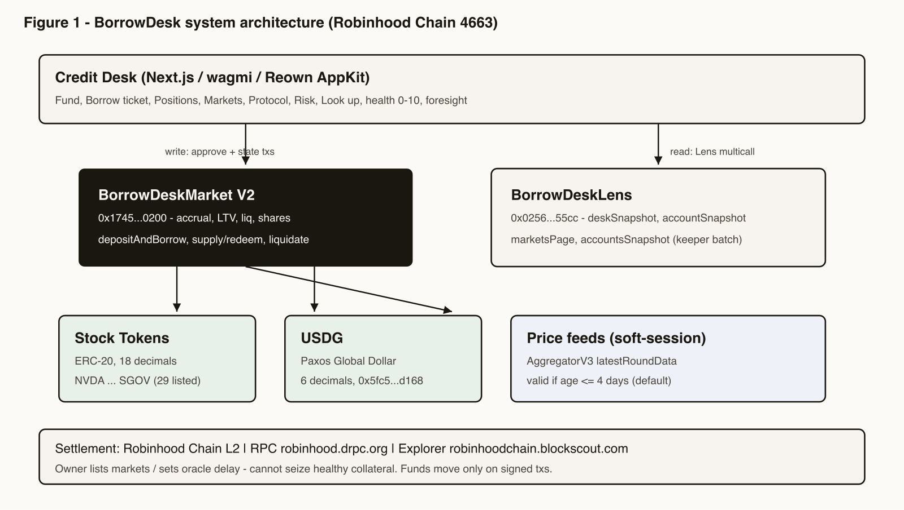
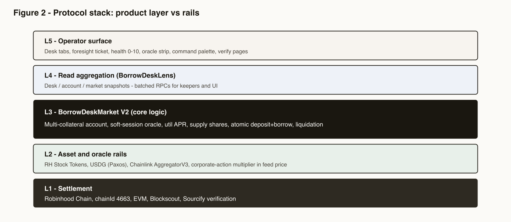
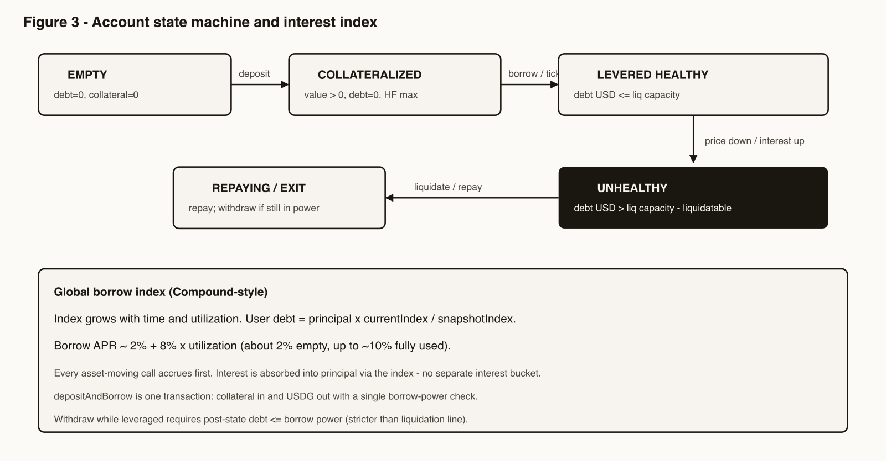
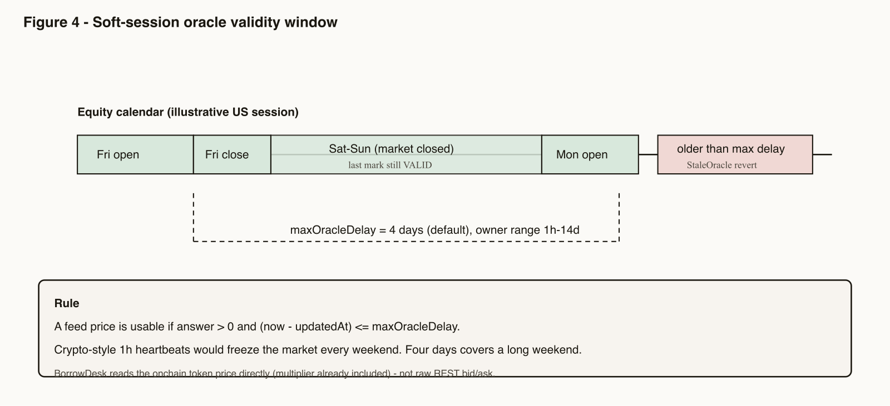
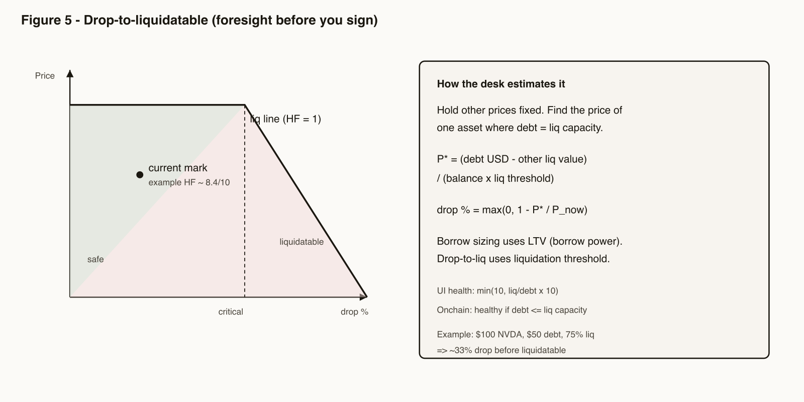

# BorrowDesk: Equity-Collateralized USDG Credit on Robinhood Chain

**Technical Litepaper · v1.2 · October 2026**  
**Author:** Amaan Sayyad  
**Status:** Live mainnet (Robinhood Chain `4663`) · Arbitrum Open House Singapore Online Buildathon  
**License:** MIT  
**App:** [https://borrowdesk.fun](https://borrowdesk.fun) · **Repo:** [github.com/AmaanSayyad/BorrowDesk](https://github.com/AmaanSayyad/BorrowDesk)

---

## Abstract

BorrowDesk is a lending market on **Robinhood Chain** where holders of official Stock Tokens (NVDA, AAPL, TSLA, SPY, and 25 more) deposit equity exposure as collateral and borrow **USDG (Global Dollar)** without selling.

The protocol is two verified contracts — `BorrowDeskMarket` V2 and `BorrowDeskLens` — plus a credit-desk UI that shows liquidation math **before** you sign. This paper explains how it works in plain language, with the key formulas, diagrams, and references a builder would want to check.

---

## 1. Why this exists

Robinhood Chain already has the raw materials: Stock Tokens as ERC-20s with Chainlink price feeds [1–3], and USDG as the dollar rail [4,5]. Robinhood’s own docs even describe “deposit stocks → borrow USDG” as a thing you can build [6].

What was missing was a **desk** for that flow:

- one account across many stocks (not a separate vault per ticker)
- risk that survives equity weekends (feeds don’t update like crypto 24/7)
- a UI that shows liq price and buffer **before** the wallet popup

Morpho-style isolated markets are great for curators [7,8]. BorrowDesk is for the operator who wants one book, clear LTV bands, and foresight — not maximum TVL cosplay.

---

## 2. What we shipped (the “invention” in practice)

Four ideas work together. None of them needs a PhD; together they are what makes BorrowDesk feel different from a generic money-market fork.

| Idea | Plain English | Onchain / product |
|---|---|---|
| **Multi-collateral account** | NVDA + AAPL share one debt line | One `Account` mapping + one borrow index |
| **Soft-session oracle** | Tolerate Friday’s mark over the weekend; fail if the feed is truly dead | `maxOracleDelay = 4 days` |
| **Foresight ticket** | “If NVDA drops X%, you’re liquidatable” before you sign | Desk math on Lens health + LTV |
| **Atomic ticket** | Deposit and borrow in one tx | `depositAndBorrow` |

Health is shown as **0–10** on the desk (capped). Under the hood it’s still the usual ratio: liquidation capacity ÷ debt.

---

## 3. Architecture

### 3.1 System overview



**Figure 1.** Desk writes to Market V2; reads batch through Lens. Stock Tokens + USDG settle on Robinhood Chain; price feeds gate every risk check.

### 3.2 Stack



**Figure 2.** L1–L2 are commodity rails (chain, tokens, oracles). L3 is BorrowDesk’s market logic. L4–L5 are Lens + the desk UI.

### 3.3 Account lifecycle



**Figure 3.** Empty → deposit → borrow → healthy leverage. If prices fall or interest accrues enough, the account becomes liquidatable. Repay or get liquidated back toward safety. Withdrawals must leave you inside **borrow power** (stricter than liquidation threshold).

---

## 4. How the market works

### 4.1 Collateral and debt

You deposit listed Stock Tokens. You borrow USDG from the pool. Each listed asset has:

- **LTV** — max you can borrow against it  
- **Liquidation threshold** — above this debt ratio, liquidators can act  
- **Liquidation bonus** — extra collateral liquidators receive (capped at 20%)

Example bands on mainnet (bps → percent): mega-caps often ~60% LTV / 75% liq; higher-beta names tighter (e.g. TSLA ~50% / 65%). Full list: `deployments/robinhood.json`.

All values are converted to USD using the asset’s AggregatorV3 feed. Internally the contract uses 18-decimal USD; USDG is 6 decimals, so:

\[
\mathrm{USD\ value\ of\ USDG} = \mathrm{amount} \times 10^{12}
\]

### 4.2 Health (simple version)

\[
\mathrm{Borrow\ power} = \sum_t (\mathrm{value}_t \times \mathrm{LTV}_t)
\]

\[
\mathrm{Liq\ capacity} = \sum_t (\mathrm{value}_t \times \mathrm{liq\ threshold}_t)
\]

- **Can borrow / withdraw?** debt ≤ borrow power  
- **Healthy?** debt = 0, or debt ≤ liq capacity  

Desk display:

\[
\mathrm{HF}_{0\text{–}10} = \min\!\left(10,\ \frac{\mathrm{Liq\ capacity}}{\mathrm{debt}} \times 10\right)
\]

### 4.3 Interest

Interest uses a Compound-style global index [11]. Roughly:

\[
\mathrm{utilization}\ u = \frac{\mathrm{total\ debt}}{\mathrm{idle\ USDG} + \mathrm{total\ debt}}
\]

\[
\mathrm{borrow\ APR} \approx 2\% + 8\% \times u
\quad\Rightarrow\quad
\text{about }2\%\text{ empty pool, up to }{\sim}10\%\text{ fully used}
\]

Every deposit / borrow / repay / liquidate accrues first. There is no separate “accrue” button in the product — it happens inside the market call.

### 4.4 Supplying USDG

Anyone can `supply` USDG and receive shares. Share value rises as borrowers pay interest:

\[
\mathrm{total\ assets} = \mathrm{idle\ USDG} + \mathrm{total\ debt}
\]

Redeem needs enough **idle** cash. If almost everything is borrowed, suppliers may wait — normal money-market behavior.

---

## 5. Oracles and weekends



**Figure 4.** Equity markets close on weekends. A 1-hour crypto-style staleness check would freeze the market every Friday. BorrowDesk allows marks up to **4 days** old (owner can set 1 hour–14 days). It does **not** invent a Sunday price — it keeps using the last good mark until the feed updates or the window expires.

Feeds return **token** price (share × corporate-action multiplier) [2,3]. Don’t mix them with raw REST equity quotes without applying the multiplier [13].

---

## 6. Liquidation foresight



**Figure 5.** Before you sign a borrow, the desk estimates how far a name can fall before you hit the liquidation line.

For a single stressed asset (other prices fixed), the critical price is:

\[
P^\star = \frac{\mathrm{debt\ USD} - (\mathrm{liq\ value\ of\ other\ collateral})}{\mathrm{balance} \times \mathrm{liq\ threshold}}
\]

\[
\mathrm{drop\ \%} = \max\!\left(0,\ 1 - \frac{P^\star}{P_{\mathrm{now}}}\right)
\]

**Tiny example.** 1 NVDA at $100, 75% liq threshold, $50 debt, no other collateral → liquidatable around $66.67 → about a **33%** drop. The ticket should say that up front.

Liquidators repay USDG on unhealthy accounts and seize collateral with a bonus. Partial repay is allowed (no close-factor in V2).

Atomic path for one-click tickets:

```text
depositAndBorrow(token, depositAmount, borrowAmount)
→ pull stock → raise debt → check borrow power → push USDG
```

One signature, one health check — no gap between “I deposited” and “I borrowed” across two txs.

---

## 7. Contracts and desk

| Piece | Address | Role |
|---|---|---|
| **Market V2** | [`0x1745…0200`](https://robinhoodchain.blockscout.com/address/0x17452DAB5976B770107c126fBC92aD746a3C0200) | Deposits, borrows, supply, liquidations · [Sourcify](https://repo.sourcify.dev/4663/0x17452DAB5976B770107c126fBC92aD746a3C0200) |
| **Lens** | [`0x0256…55cc`](https://robinhoodchain.blockscout.com/address/0x025694b88ddd0a6ffac740df4170b8ea590355cc) | Batched reads for desk + keepers · [Sourcify](https://repo.sourcify.dev/4663/0x025694b88ddd0a6ffac740df4170b8ea590355cc) |
| **USDG** | `0x5fc5…d168` | Borrow asset · 6 decimals [5] |
| **Legacy V1** | `0x2e4E…9E8d` | Drained / unused |

**User funds** move only when the wallet signs `approve` + market calls. The owner can list markets and set oracle delay — **not** seize healthy collateral.

Desk tabs: Overview · Borrow · Fund · Positions · Markets · Protocol · Risk · Look up · Start. Fund covers get-stock, supply USDG, and batch deposit+borrow. Wallet via Reown AppKit [14].

---

## 8. Risks (honest)

1. **Weekend marks stick** — Friday price may not equal Monday open.  
2. **No close factor yet** — liquidations can take a large bite.  
3. **Supplier exits need idle cash** — high utilization can delay redeems.  
4. **Owner key** — bad listings (rogue feed) are the main admin risk until ownership hardens.  
5. **Small inventory today** — rates and liquidations behave differently at scale.  
6. **Stock Tokens ≠ shares** — legal wrapper of the issuer applies [1].  
7. **No formal audit yet** — Sourcify proves source matches bytecode; it does not prove economic safety.

Report security issues privately — don’t post exploit PoCs against live funds.

---

## 9. Competitive landscape (short)

| Venue | Style | BorrowDesk difference |
|---|---|---|
| **Morpho** on RH [7,8] | Isolated markets / vaults | We optimize for one multi-stock book + foresight desk |
| **Acre** [15] | Multi-collateral USDG | Closest peer; we push desk UX, 29 feeds, public Lens/V2 verify |
| **Zona** [16] | One equity at a time; 24/5 window | We keep multi-collateral + 4d soft oracle |
| **Pledge** [17] | Isolated per ticker | Shared account + atomic ticket |
| **Ondo / xStocks** [18,19] | Other chains | Not RH Stock Tokens / USDG on 4663 |

---

## 10. Economics

**Today:** borrowers pay ~2–10% APR by utilization; suppliers earn that interest via share value; liquidators earn the bonus. No protocol fee. No product token.

**Later:** planned **1% borrow fee**, a **protocol token** for governance / incentives (USDG stays the borrow asset), and interest splits as the pool grows.

---

## 11. Formula card

```
utilization     = debt / (idle + debt)
borrow APR      ≈ 2% + 8% × utilization
debt(user)      = principal × borrowIndex / snapshot
borrow power    = Σ collateralUSD × LTV
liq capacity    = Σ collateralUSD × liqThreshold
healthy         = debt == 0 OR debt ≤ liq capacity
HF (0–10)       = min(10, liq capacity / debt × 10)
drop to liq     = max(0, 1 − P* / P_now)
oracle OK       = price > 0 AND age ≤ 4 days (default)
```

---

## 12. Deployment

| Item | Value |
|---|---|
| Chain | Robinhood Chain mainnet (`4663`) |
| Market V2 | `0x17452DAB5976B770107c126fBC92aD746a3C0200` |
| Lens | `0x025694b88ddd0a6ffac740df4170b8ea590355cc` |
| Owner | `0x1881Dfd2b29536F054AA0b0A4966856290388Cc2` |
| Listed markets | 29 Stock Token / ETF feeds |
| App | https://borrowdesk.fun |
| Pitch | [Chronicle](https://app.chroniclehq.com/share/0f55cc23-897b-4a17-9ae9-c430e7e7eadb/50e19e22-0cd9-437e-afc0-9cab97129f3f) |
| Demo | https://youtu.be/fCIIUwtG35g |
| Hackathon | [Arbitrum Open House Singapore](https://arbitrum-singapore.hackquest.io/buildathons/Arbitrum-Open-House-Singapore-Online-Buildathon) [20] |

---

## 13. Closing

BorrowDesk is small on purpose: one market contract you can read, a lens for the desk, and UI that refuses to hide liquidation risk. The useful idea is simple — **bring dollar credit to where the stocks already are**, keep the oracle honest about weekends, and show the knife edge before anyone leans on it.

---

## References

1. Robinhood Chain — *Stock Tokens*. https://docs.robinhood.com/chain/stock-tokens/  
2. Robinhood Chain — *Oracles & Price Feeds*. https://docs.robinhood.com/chain/oracles-and-price-feeds/  
3. Robinhood Chain — *Building with Stock Tokens*. https://docs.robinhood.com/chain/building-with-stock-tokens/  
4. Paxos — *USDG Overview*. https://docs.paxos.com/guides/stablecoin/usdg  
5. Paxos — *USDG on Main Networks*. https://docs.paxos.com/guides/stablecoin/usdg/mainnet  
6. Same as [3] — collateral → borrow USDG pattern.  
7. Morpho Docs. https://docs.morpho.org/  
8. Robinhood — *Crypto Earn*. https://robinhood.com/us/en/support/articles/crypto-earn/  
9. Robinhood Chain — *Contracts*. https://docs.robinhood.com/chain/contracts/  
10. Sourcify. https://docs.sourcify.dev/  
11. Leshner & Hayes — *Compound: The Money Market Protocol*. https://compound.finance/documents/Compound.Whitepaper.pdf  
12. Aave — *Borrow Interest Rate*. https://docs.aave.com/risk/liquidity-risk/borrow-interest-rate  
13. Robinhood Chain — *Stock Token APIs*. https://docs.robinhood.com/chain/stock-token-apis/  
14. Reown Docs. https://docs.reown.com/  
15. Acre. https://useacre.xyz  
16. Zona Finance. https://www.zona.finance  
17. Pledge Finance (Open House). https://arbitrum-singapore.hackquest.io/projects/Pledge-Finance-TRgoRA  
18. Ondo Finance. https://ondo.finance/  
19. Backed — xStocks. https://backed.fi/  
20. HackQuest — Arbitrum Open House Singapore Online Buildathon. https://arbitrum-singapore.hackquest.io/buildathons/Arbitrum-Open-House-Singapore-Online-Buildathon  
21. Chainlink — *Using Data Feeds*. https://docs.chain.link/data-feeds/using-data-feeds  
22. EIP-20. https://eips.ethereum.org/EIPS/eip-20  
23. Arbitrum Docs. https://docs.arbitrum.io/  
24. BorrowDesk repo. https://github.com/AmaanSayyad/BorrowDesk  
25. Market V2 (Blockscout). https://robinhoodchain.blockscout.com/address/0x17452DAB5976B770107c126fBC92aD746a3C0200  
26. Global Dollar Network. https://globaldollar.com/build-with-usdg  

---

*© 2026 Amaan Sayyad / BorrowDesk. Informational only — not financial or legal advice. Stock Tokens and USDG follow their issuers’ terms.*
